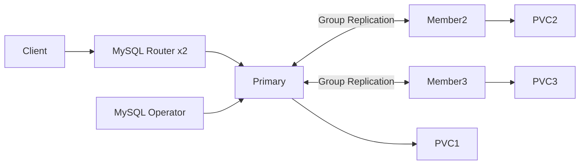

# MySQL InnoDB Cluster on Kubernetes

[](https://github.com/imos64/mysql-kubernetes/actions/workflows/validate.yaml)
[](https://kubernetes.io/)
[](https://helm.sh/)
[](terraform/)
[](opentofu/)

Maintained by [imos64](https://github.com/imos64). A public deployment package with pinned sources, native Kubernetes manifests, Helm, Terraform and OpenTofu, architecture documentation, and recovery runbooks. It follows the structure of [prometheus-kubernetes](https://github.com/imos64/prometheus-kubernetes/tree/main).

## Architecture

Oracle MySQL Operator manages three Group Replication members and two MySQL Router instances. Hard anti-affinity distributes database members over three hosts.



A majority of the three Group Replication members must remain connected. Router directs new connections after primary election; transactions in flight need application retries. Two Routers do not compensate for loss of database quorum.

## Delivery paths

| Path | Purpose |
| --- | --- |
| `charts/mysql` | Local Helm chart and base/production values |
| `k8s/base`, `k8s/production` | Reproducible rendered manifests with Kustomize entry points |
| `terraform`, `opentofu` | Alternative Helm release owners on an existing Kubernetes cluster |
| `scripts` | Rendering, schema validation, secret-reference and topology checks |
| `docs` | Architecture, configuration, operations, validation and source provenance |
| `examples` | Deployment-specific integration and recovery examples |

Use **one** delivery path per release. These modules deploy applications to an existing cluster; they do not provision cloud networks, worker nodes, DNS, object storage or a CSI driver. Base is smaller for evaluation, while production increases storage/resources and supported replicas. Neither profile configures your organization's backup destination or proves an availability SLO.

## Prerequisites

- Kubernetes 1.34-compatible APIs, Helm 3, and a working default RWO StorageClass for stateful workloads. Plan storage expansion and volume reattachment; node-local storage cannot survive permanent node loss.
- For three-member clusters, three schedulable workers in appropriate fault domains. Set node/zone placement and storage topology for your environment.
- A CNI that enforces NetworkPolicy. Workload ingress permits this namespace and namespaces explicitly labeled `platform-access=true`; egress is not restricted by the supplied policy. Internal HTTP services need TLS/authentication at your approved access boundary.
- An explicit kubeconfig/context and namespace access. Operator installation additionally requires cluster-scoped CRD/RBAC privileges.
- Existing credentials delivered by your secret manager. No real passwords, certificates, state files or private project configurations are committed.

Oracle registry access to the pinned Community images is required. Bootstrap creates the root account; provision least-privilege application users and databases separately. Development TLS is self-signed; install your approved CA and client trust before production.

## Quick start

```bash
git clone https://github.com/imos64/mysql-kubernetes.git
cd mysql-kubernetes
export KUBECONFIG=/absolute/path/to/your/kubeconfig
kubectl config current-context
kubectl create namespace mysql
```

Review [configuration and credentials](docs/configuration.md) before installation. `scripts/bootstrap-demo-secrets.py` generates fresh credentials directly in the selected cluster for a disposable evaluation; it refuses to overwrite an existing secret and never prints generated passwords. For production, provision the same keys using your secret-management workflow.

```bash
python3 scripts/bootstrap-demo-secrets.py --context YOUR_CONTEXT
```

### Helm

```bash
helm upgrade --install mysql-operator ./operator -n mysql --wait --timeout 15m
# Wait for the operator and its CRDs before installing the workload.
helm upgrade --install mysql ./charts/mysql -n mysql \
  -f charts/mysql/values-production.yaml --wait --timeout 15m
```

Add `-f /secure/path/site-values.yaml` last for your storage class, sizing and integrations. Helm's release wait does not prove database quorum or custom-resource readiness; run the acceptance checks below.

### Native Kubernetes

Install the operator separately first. CRDs use server-side apply to avoid client-side annotation size limits. Review CRD changes before upgrading shared operators.

```bash
kubectl apply --server-side -k k8s/operator
kubectl wait --for=condition=Established --timeout=120s -f <(kubectl kustomize k8s/operator | python3 scripts/select-crds.py)
# Wait for operator deployments to be Available before the next command.
```
```bash
kubectl apply --server-side -k k8s/production
```

For customized native manifests, edit chart values then run `make render` and review the diff. The rendered namespace/release defaults are `mysql`; re-render intentionally if you change that contract. Helm hook Jobs become ordinary Jobs under kubectl, so check their completion and delete only completed setup Jobs before rerunning changed hooks.

### Terraform or OpenTofu

Both modules use the same pinned local Helm source. They require the namespace and secrets to exist first. Keep state in an encrypted remote backend with locking; state and plans can contain sensitive information.

```bash
terraform -chdir=terraform init
terraform -chdir=terraform plan -var='kube_context=YOUR_CONTEXT' -out=deployment.tfplan
terraform -chdir=terraform apply deployment.tfplan
# OR
 tofu -chdir=opentofu init
 tofu -chdir=opentofu plan -var='kube_context=YOUR_CONTEXT' -out=deployment.tfplan
 tofu -chdir=opentofu apply deployment.tfplan
```

Use `kubeconfig_path` and `values_files` to supply your environment. See `deployment.tfvars.example`. Never manage the same release from Terraform and OpenTofu simultaneously. Set `install_operator=false` when your platform team already owns a compatible operator.

## Access and acceptance

Internal endpoint: **`mysql.mysql.svc.cluster.local:6446 (read/write Router); port 6447 (read-only Router)`**.

Wait for `status.cluster.status=ONLINE` and `status.cluster.onlineInstances=3` on `innodbcluster/mysql`. Confirm both Routers are ready. Write a marker through port 6446, stop one primary pod in a disposable cluster, reconnect, and check the marker and new primary. Never test by removing two members at once.

## Operations and recovery

Define an operator `backupProfiles` entry for an encrypted object-store destination and a `backupSchedules` entry before accepting production data. Use MySQL Shell dump/load for a logical recovery drill. Confirm the dump is transactionally consistent for your workload; replication and PVC snapshots alone are not a complete recovery plan.

See [operations](docs/operations.md) for backup, restore, upgrade and failure checks. HA replication is not a backup. Retained PVCs do not protect against storage-system failure, accidental deletion or site loss.

## Validation

```bash
python3 -m venv .venv
. .venv/bin/activate
pip install -r requirements-dev.txt
python3 scripts/install-tools.py
export PATH="$PWD/.tools:$PATH"
make render
make validate
```

CI checks deterministic rendering, strict Helm lint, Kubernetes and custom-resource schemas, topology/secret contracts, Terraform/OpenTofu validation and secret scanning. Runtime acceptance and disaster-recovery steps are documented separately in [validation evidence](docs/validation.md); configuration validation is not proof of production readiness.

## Sources and license

This repository owns the integration/deployment code, not the upstream application. [Upstream project](https://github.com/mysql/mysql-operator) · [Official documentation](https://dev.mysql.com/doc/mysql-operator/en/). See [provenance](docs/provenance.md) for pinned versions and SHA-256 chart checksums. Deployment code is Apache-2.0; bundled upstream charts, schemas and container images retain their original licenses. Review application licensing for your use case, especially Nexus, SonarQube, Redis and MongoDB-derived distributions.
